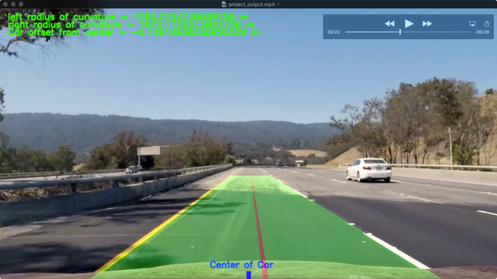
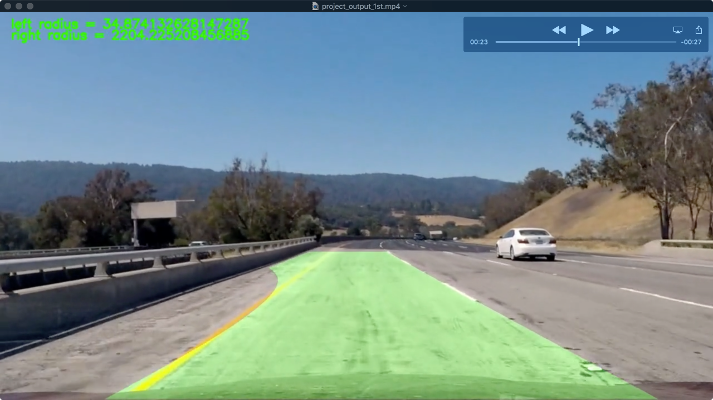

## Korda's Advanced Lane Finding Project for Udacity Self-Driving Car Nanodegree

[YouTube Video](https://youtu.be/mDcqw8k7jtw)
[](https://youtu.be/mDcqw8k7jtw)


---

The goals / steps of this project are the following:

* Compute the camera calibration matrix and distortion coefficients given a set of chessboard images.
* Apply a distortion correction to raw images.
* Use color transforms, gradients, etc., to create a thresholded binary image.
* Apply a perspective transform to rectify binary image ("birds-eye view").
* Detect lane pixels and fit to find the lane boundary.
* Determine the curvature of the lane and vehicle position with respect to center.
* Warp the detected lane boundaries back onto the original image.
* Output visual display of the lane boundaries and numerical estimation of lane curvature and vehicle position.


## [Rubric Points](https://review.udacity.com/#!/rubrics/571/view) 

### Here I will consider the rubric points individually and describe how I addressed each point in my implementation.  

---

### Writeup / README

#### 1. Provide a Writeup / README that includes all the rubric points and how you addressed each one.

You're reading it!

### Camera Calibration

#### 1. Briefly state how you computed the camera matrix and distortion coefficients. Provide an example of a distortion corrected calibration image.

The code for this step is contained in the second code cell of the IPython notebook located in "./Advanced-Lane-Finding.ipynb".  

I start by preparing "object points", which will be the (x, y, z) coordinates of the chessboard corners in the world. Here I am assuming the chessboard is fixed on the (x, y) plane at z=0, such that the object points are the same for each calibration image.  Thus, `objp` is just a replicated array of coordinates, and `objpoints` will be appended with a copy of it every time I successfully detect all chessboard corners in a test image.  `imgpoints` will be appended with the (x, y) pixel position of each of the corners in the image plane with each successful chessboard detection.  

I then used the output `objpoints` and `imgpoints` to compute the camera calibration and distortion coefficients using the `cv2.calibrateCamera()` function.  I applied this distortion correction to the chessboard images using the `cv2.undistort()` function and obtained this result: 

![alt text][1]

  [1]: ./test_images/Original+Undistort2.png "Original and Undistorted Chessboard"
  
Can you see how the fish eye effect is removed? Cool right?

### Pipeline (single images, video come later but is very similar)

#### 1. Provide an example of a distortion-corrected image.

To demonstrate this step, I will describe how I apply the distortion correction to one of the test images like this one:

![alt text][2]

  [2]: ./test_images/straight_lines1.jpg "Original Test Image Straight Lines"
  
Here is what it looked like after it is undistorted. It is not very noticeable without well defined lines like the chessboard had, but if you look close you can see the green and white sign on the right side of the road shifts slightly. This step is very important in creating an accurate mapping of the image points to the realworld. This helps to maintain accurate radii of curvature and distance measurements, which are paramount to the software properly perceiving the world.
  
![alt text][3]

  [3]: ./test_images/test_undist_road.png "Undistorted Road Image Straight Lines"
  
To make the comparison a little easier here they are side by side. Can you see it? The sign moves closer and twists more perpendicular to the road.

![alt text][4]

  [4]: ./test_images/Original+Undistort.png "Original and Undistorted Road Image"

#### 2. Describe how (and identify where in your code) you used color transforms, gradients or other methods to create a thresholded binary image.  Provide an example of a binary image result.

The code for creating a thresholded binary is in code cell number 6 in the IPython notebook. 
This task is really about trying to remove as much data that we can from the image and retain only pixels that represent the lane lines. I applied a few thresholding techniques learned in the lessons including: Color space transformation, gradient magnitude, gradient direction and color thresholding. Below is an example of a binary image with each threshold stored in one of the BGR channels. The green is the x direction gradient, which itself used the binary lightness channel of the HLS colorspace as a starting point. The red is the saturation channel from the HLS color space. The blue and white are the hue channel binaries (white areas mean that all three binaries exist there. I later change the BGR binary into a 'white hot' binary collapsing all the binaries into one channel. This helped with pipeline processing.

Here is the original test image with the thresholded image
![alt text][5]

  [5]: ./test_images/Color-Gradient-Binary.png "Color and Gradient Thresholded Image"
  
Here is what it looks like when I combined all channels into one 'white hot' channel.
  
![alt text][6]

  [6]: ./test_images/white-hot-binary.png "White Hot Binary Thresholded Image"
  
In addition to creating the binary I later added a mask to remove unwanted image data that might distract the lane finding function `find_lane()`. Here is an example of what that looked like. This might not have been necessary if I was able to threshold the lane lines better which would have removed unwanted pixels, but for this project I was not able to remove that much detail and isolate just the lines. The mask achieves a similar result with the cost of loosing some field of view for sharp curves. 

![alt text][20]

  [20]: ./test_images/masking.png "Masked White Hot Binary Thresholded Image"


#### 3. Describe how (and identify where in your code) you performed a perspective transform and provide an example of a transformed image.

The code for my perspective transform includes a function called `lines_warp()`, which appears in the 8th code cell of the IPython notebook.  The `lines_warp()` function takes as inputs an image (`img`), as well as `inv=0` (`inv=1` performs inverse transform) and `draw=None` (`draw=True` draws the perspective line for visualization)  I chose to hardcode the source and destination points in the following manner. This is essentially the corners of the masking:

```python
imshape = color_grad.shape
# White and yellow video Values
lbxper = .14 # left bottom x vertice percentage
rbxper = .89 # right bottom x vertice percentage
byper = 1 # bottom y vertices percentage
typer = .63 # top y vertices percentage
lm = -0.453 # left slope 
rm = 0.6 # right slope

# Vertices calculations
xlb = imshape[1]*lbxper
ylb = imshape[0]*byper
xlt = (imshape[0]*typer - ylb)/lm
ylt = imshape[0]*typer
xrb = imshape[1]*rbxper
yrb = ylb
xrt = (ylt - ylb)/rm + xrb
yrt = ylt

vertices = np.array([[(xlb,ylb),(xlt, ylt), (xrt, yrt), (xrb,yrb)]], dtype=np.int32)

# Define polygon vertices for masking
left_bottom = vertices[0][0]
right_bottom = vertices[0][3]
left_top = vertices[0][1]
right_top = vertices[0][2]

if draw:
    # Draw perspective lines on img
    cv2.line(img, (left_bottom[0], left_bottom[1]), (left_top[0], left_top[1]), (255,0,0), 1)
    cv2.line(img, (right_bottom[0], right_bottom[1]), (right_top[0], right_top[1]), (255,0,0), 1)
    cv2.line(img, (left_bottom[0], left_bottom[1]), (right_bottom[0], right_bottom[1]), (255,0,0), 1)
    cv2.line(img, (left_top[0], left_top[1]), (right_top[0], right_top[1]), (255,0,0), 1)


# Perpective warp

offset = 250
# define 4 source points src = np.float32([[,],[,],[,],[,]])
src = np.float32([[left_bottom[0], left_bottom[1]], [right_bottom[0], right_bottom[1]], 
                 [right_top[0], right_top[1]], [left_top[0], left_top[1]]])
#     print('Source Corners = ', src)

# define 4 destination points dst = np.float32([[,],[,],[,],[,]])
dst = np.float32([[offset, imshape[0]], [imshape[1]-offset, imshape[0]], 
                                 [imshape[1]-offset, 0], 
                                 [offset, 0]])
```

This resulted in the following source and destination points:

|Source         |Destination    |
|:-------------:|:-------------:| 
|179, 720       |250, 720       |
|1139, 720      |1030, 720      |
|695, 453       |1030, 0        |
|588, 453       |250, 0         |

I verified that my perspective transform was working as expected by drawing the `src` and `dst` points, connected by lines, onto a test image and its warped counterpart to verify that the lines appear parallel in the warped image. You can see examples of the warped images in normal vision and binary vision. In all cases the `src` and `dst` lines are parrallel in the warped image. In the last image I show that the curved lines are also parallel. Something in the way I handled the white hot binaries caused the `src` and `dst` points and lines not to appear in the left image but they were there since they appear in the warped images. 

Here is the original test image on the left with the warp to the right. This image was selected because the lane is straight so we can assume the lines should end up parallel, which they did.


![alt text][7]
  
  [7]: ./test_images/Warped-Binary-Curved.png "Warped Original"
  
  
Here we have the same test image in white hot binary and its warp counterpart.  

  
![alt text][8]

  [8]: ./test_images/Warped-Binary-Curved1.png "Warped Binary Straight"
  
  
And finally here is a different test image with curved lines that are still parallel  

  
![alt text][9]

  [9]: ./test_images/Warped-Binary-Curved2.png "Warped Binary Curved"
  
  

#### 4. Describe how (and identify where in your code) you identified lane-line pixels and fit their positions with a polynomial?

Lane line pixel detection and polynomial fitting were done with the function `find_lines()` in code cell 23 of the IPython notebook. The warped binary thresholded and masked image is given as input. Then a histogram is calculated of the binary to see where the lines are most likely to be. The tallest peak on the left and right are determined to be the lines. 

![alt text][100]

  [100]: ./test_images/Warped-Histogram.png "Warped with Histogram"

Then a sliding window search is done from the bottom of the image to the top in `n` increments with a window width of 75 pixels. Anytime a pixel falls inside the window and there are at least 50 other of them it considers it a line and stores the pixels for later fitting. Once all the detected line pixels are stored, a polynomial of order 2 is fit to each the left and right lines using the function y = A(x)^2 + B(x) + C. Here is an example of the sliding windown search with the fit line in yellow and windows plotted in green (another glitch caused only parts of the windows to display). The left line pixels are colored red and right are blue. 

![alt text][10]

  [10]: ./test_images/Sliding-Window-PolyFit.png "Sliding Window Fit"

After the first run of the sliding window search, a better method is used to search since we already know where the lines were from the previous frame of the video. Since we living in a contiuous causal world (sorry no teleporting), we start looking at the previous frame fit with a margin around the lines. If we end up loosing the line we start over with the sliding window search. Here is an example of the causal search with the green band being the margin about the previous fit.

![alt text][11]

  [11]: ./test_images/Skip-Sliding-Window-PolyFit.png "Previous Detection Fit"
  

#### 5. Describe how (and identify where in your code) you calculated the radius of curvature of the lane and the position of the vehicle with respect to center.

Radius of curvature of each lane line is done in the function `radius()` (code cell 21), which takes as inputs a linear space of y values of the image as well as the x values of the most current polynomial fit. The equation used for this is shown below. The equation is based on the first and second derivative of the polynomial fit.

Radius_of_curve =[(1+(2Ay+B)^2)^3/2]/∣2A∣

Here is an example of the radius annotated on the video image along with the center of the car and the calculated lane center.

![alt text][16]

  [16]: ./test_images/radius.png "Radius of Curvature and Lane"

#### 6. Provide an example image of your result plotted back down onto the road such that the lane area is identified clearly.

I implemented this step in code cell 24 inside the `process_image` pipeline.  Here is an example of my result on a test image:

First we have the original image (Red and Blue channels are reversed because opencv uses BGR channels where as pylot uses RGB)

![alt text][12]

  [12]: ./test_images/Drawlane1.png "Original"
  
Then the warped top-down perspective of the lane.
  
![alt text][13]

  [13]: ./test_images/Drawlane2.png "Warped"
  
Then the painted detection of the lane.
  
![alt text][14]

  [14]: ./test_images/Drawlane3.png "Lane Detection"
  
Lastly, we unwarp the combined image and painted lane using the inverse perspective matrix `Minv`.
  
![alt text][15]

  [15]: ./test_images/Drawlane4.png "Painted Lane"

---

### Pipeline (video)

#### 1. Provide a link to your final video output.  Your pipeline should perform reasonably well on the entire project video (wobbly lines are ok but no catastrophic failures that would cause the car to drive off the road!).

[Here's a link to my video result](https://youtu.be/mDcqw8k7jtw)

[YouTube Video](https://youtu.be/mDcqw8k7jtw)
[](https://youtu.be/mDcqw8k7jtw)

The repository file is available at this [link](./project_output.mp4)

---

### Discussion

#### 1. Briefly discuss any problems / issues you faced in your implementation of this project.  Where will your pipeline likely fail?  What could you do to make it more robust?

The lessons prepared us very well for this challenge. Below is a link to the first attempt at detecting the lanes using only the code learned in the lessons. 

[Here's a link to my first attempt video result](https://youtu.be/fi-f2ONK2X0)

[YouTube Video](https://youtu.be/fi-f2ONK2X0)
[](https://youtu.be/fi-f2ONK2X0)

The repository file is available at this [link](./project_output_1st.mp4)

When the lines are well contrasted with the blacktop the pipeline performs very well. However, when it gets to the bridge areas it fails catastrophically, trying to send us into the divider. This is due to the pipeline loosing the yellow lane against the lighter background and then finding the sharp contrast in the wall and thinking that was the lane. The first thing I did was decide to limit what the pipeline could see. So I added the mask mentioned earlier. This helped a little but the pipeline still lost the line and had poor performance.

The next thing I decided to implement is a sanity check of the newest lane fit curvature to see if it drastically changes. If it did then I reject the new fit and use the old one. This worked a little but caused the left lane to permanently break if it lost too many frames. 

Then I tried averaging the last 4 frame fits and using that as the basis of lane painting. This worked much better in maintaining stability and preventing catastrophy, but came at the cost of responsiveness to the lane lines. There is a noticable lag and dead spots if it looses the lane, but it does recover the lines once they become more contrasted.

There are many things I would have liked to try given more time. I have listed them below.

* A Kalman filter with lane parameter quality as weighting factors.
* * Lane width check with high weight given to a proper width.
* * Lane parallel check with high weight given based on degree of parallelism.
* * High weight for matching curvature directions (many times the one lane would curve away from the road while the other was still correct.

* Better thresholding in color space to really isolate the yellows and whites of the lane lines
* * Possibly try LAB color space which I read is good for yellow isolation.
* * Implement a better direction gradient or magnitude.

P.S. I would like to thank the creators of Udacity and the lessons for creating a wonderful learning environment and the tremendous effort they put forth in preparing these lessons. Your work is noticed and appreciated.

I appreciate them making learning more attainable for those of us who cannot tinker blindly and need more direction. The lessons are well guided but still leave room for challenge and growth. 
